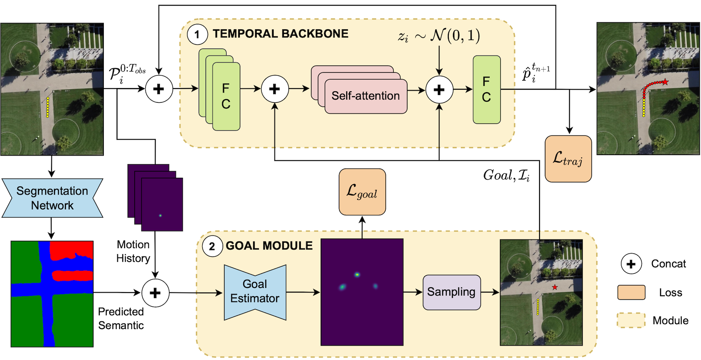
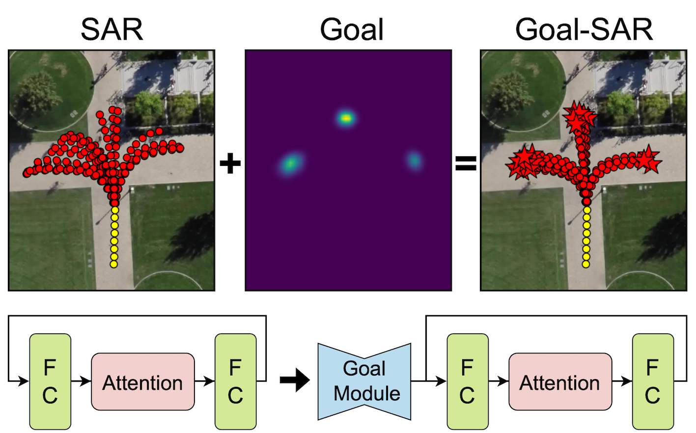
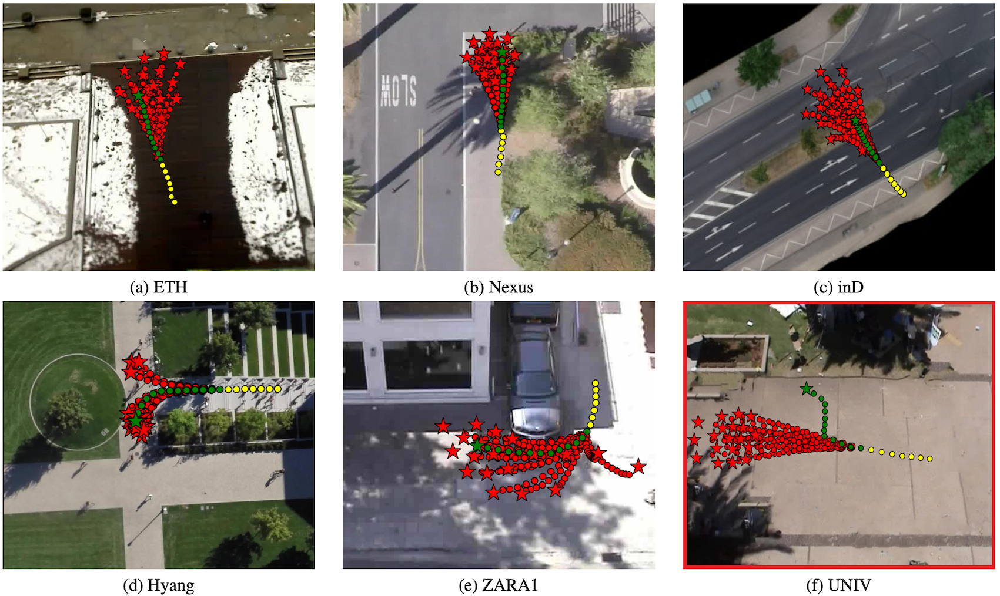

# Goal-driven Self-Attentive Recurrent Networks for Trajectory Prediction

[](https://arxiv.org/abs/2204.11561)
[](https://sites.google.com/view/ieeecvf-cvpr2022-precognition)

This repository hosts the official code related to *"Goal-driven Self-Attentive Recurrent Networks for Trajectory Prediction"*, Luigi Filippo Chiara, Pasquale Coscia, Sourav Das, Simone Calderara,
Rita Cucchiara and Lamberto Ballan.
[[Download paper](https://openaccess.thecvf.com/content/CVPR2022W/Precognition/papers/Chiara_Goal-Driven_Self-Attentive_Recurrent_Networks_for_Trajectory_Prediction_CVPRW_2022_paper.pdf)]




## Reference


If you use the code/models of this repo and find this project useful 
please cite our paper and consider giving a star ⭐!


```bibtex
@misc{chiara2022trajectory,
      title={Goal-driven Self-Attentive Recurrent Networks for Trajectory Prediction},
      author={Chiara, Luigi Filippo and Coscia, Pasquale and Das, Sourav and Calderara, Simone and Cucchiara, Rita and Ballan, Lamberto},
      year={2022},
      eprint={2204.11561},
      archivePrefix={arXiv},
      primaryClass={cs.CV}
}
```


# Updates

- **[2022/06/19]** - Workshop presentation.
- **[2022/06/15]** - The code is finally online!
- **[2022/04/20]** - Our paper is on arXiv! Here is the [link](https://arxiv.org/abs/2204.11561)
- **[2022/04/15]** - The paper has been accepted to the [CVPR-2022 Precognition workshop](https://sites.google.com/view/ieeecvf-cvpr2022-precognition)


# Install

## Raw data

Download raw data with:

```
# Donwload raw data
$ source scripts/download_data.sh
```

The script will also move the `data` folder to the parent directory of `main.py`. Raw data should be kept there.


## Environment

To run the code you need to have conda installed (version >= 4.9.2).

Depending on your machine and cuda version, install an environment from the `envs` folder. For example:

```
# Install the conda env
$ conda env create -f envs/GoalSARlinux_cuda11.yml

# Activate the conda env
$ conda activate GoalSAR
```

You can also create a new environment. See `envs/GoalSARany.yml` for all the necessary dependencies.


# Experiments

For all the experiments we used an NVIDIA GeForce RTX 3080 Ti (12GB of memory) GPU, with Cuda version 11.1. 
For the training you will need ~7500 MB of GPU memory whereas for the validation and testing ~11 GB of GPU memory.




### Download model checkpoints

You can download the model checkpoints using the `download_checkpoints.sh` script in the `scripts` folder by running:

```
# Download model checkpoints
$ source scripts/download_checkpoints.sh
```

The script will also create the folder structure and put the model checkpoints inside `./output/{dataset_name}/{model_name}/saved_models` by default. The size of each checkpoint.pt file is between ~1 MB and ~5 MB.


## Test phase

**SAR** and **Goal_SAR** models can be tested using the `main.py` program. It is important to select the model_name, dataset, test_set and phase correctly.

Different datasets are selected with the `--dataset` argument. Available datasets: [**eth5, ind, sdd**]. On `eth5` you can also select the different test scenes with `--test_set`. Available test scenes are: [**eth, hotel, zara1, zara2, univ**]. Different phases are selected with the `--phase` argument. Available phases are: [**pre-process**, **train**, **test**, **train_test**]. When selecting the test phase, a checkpoint needs to be selected with the `--load_checkpoint` argument (usually the 'best' checkpoint).

Here we reported an example of a test script for the `Goal_SAR` model:

```
$ python main.py \
	--model_name 'Goal_SAR' \
	--dataset sdd \
	--test_set sdd \
	--phase 'test' \
	--load_checkpoint 'best' \
```

For simplicity we provide the testing scripts for the `sdd` dataset in the `scripts` folder. Specifically, you will find:

- `test_SAR.sh`
- `test_Goal-SAR.sh`

that you can run as follows:

```
# Run testing
$ source scripts/test_SAR.sh
```

## Train phase

The default setting is to train on the `sdd` dataset.

Pre-processed data and batches will be saved in `./output/{dataset_name}/` by default. Model checkpoints and outputs will be saved in `./output/{dataset_name}/{model_name}/`.

For simplicity we provide the training scripts for the `sdd` dataset in the `scripts` folder. Specifically, you will find:

- `train_SAR.sh`
- `train_Goal-SAR.sh`

that you can run as follows:

```
# Run training
$ source scripts/train_Goal-SAR.sh
```

### Train from scratch

To train a model with the default configuration just run:

```
$ python main.py
```

Configuration files are also created after the first run. Arguments can then be modified through configuration files or command line. 
Priority: command line \> configuration files \> default values in script.


### Example of training

The following command is to train our `SAR` model on the `eth5` dataset and to test it on the `hotel` scene. The model will train for 300 epochs with a batch size of 128 pedestrians. In the end, the model yielding the best ADE will be tested on the test set.

```
$ python main.py \
	--dataset eth5 \
	--test_set hotel \
	--model_name SAR \
	--num_epochs 300 \
	--batch_size 128 \
	--phase train_test
```




# Code structure

The code is developed in PyTorch and is contained in the `src` folder.
It is meant to be as generic and reusable as possible. The content of `parser.py`, `data_pre_process.py`, `data_loader.py`, `trainer.py`, `losses.py`, `metrics.py` and `utils.py` is self-explanatory.

The `model` folder contains a `base_model.py` class from which all the models inherit.

The `data_src` folder contains some reusable code for data preparation and pre-processing. Every dataset is made of a dataset object (`dataset_src`) which is nothing but a dictionary of scenes, many scene objects (`dataset_src`) representing individual scenes with methods to go from world to pixel coordinates and vice versa, and an experiment object (`experiment_src`) containing metadata about the experiment to be performed and train-test splits. The trajectory data is loaded inside the experiment class and then pre-processed with the code from `data_pre_process.py`.

## Wandb

Log curves and result plots are automatically syncronized online at [wandb](https://wandb.ai/site). 

You need to create an account there in order to see them. Alternatively, you can turn wandb off with the argument `--use_wandb=False`. Or you can type `$ wandb offline` if you only want to run wandb locally. If you want to use wandb, you also need to change the wandb entity parameter in the wandb.init function at line 259 of `trainer.py`.


## Contact

For any questions about code and reusability, please do not hesitate to raise an issue here on GitHub. Thank you!


